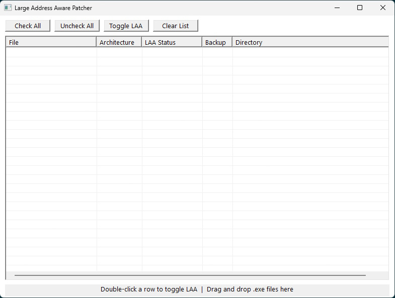

# Large Address Aware Patcher

A C++23 GUI tool for toggling the `IMAGE_FILE_LARGE_ADDRESS_AWARE` flag on 32-bit Windows PE executables.

This allows a 32-bit process to access up to **4GB of virtual address space** on 64-bit Windows, instead of the default 2GB limit.
This is great for older games or any 32-bit applications that hit memory limits.



## Usage

1. **Drag and drop** one or more `.exe` files onto the window
2. Each file appears as a row showing its **architecture**, **LAA status**, **backup setting**, and **directory**
3. Use the checkboxes to select which files to process
4. **Double-click** a row or hit **Toggle LAA** to enable or disable the flag

### Toolbar

| Button | Description |
|---|---|
| **Check All** | Select all rows |
| **Uncheck All** | Deselect all rows |
| **Toggle LAA** | Enable or disable the LAA flag for all checked rows |
| **Clear List** | Remove all entries from the list |

### Per-row backup control

Each file defaults to **Backup: Yes** a `.bak` copy of the original is created before patching.

To change backup behaviour for a specific file, **right-click** the row:

| Option | Description |
|---|---|
| **Backup** (checkmark) | Toggle backup on or off for this file |
| **Remove** | Remove this entry from the list |

You can also press **Delete** to remove the selected row.

### Example

Here is an example of using a 32-bit game like Dungeon Siege 1.
 
Dropping `DungeonSiege.exe` onto the window shows:
 
| File | Architecture | LAA Status | Backup | Directory |
|---|---|---|---|---|
| DungeonSiege.exe | 32-bit | Disabled | Yes | C:\Program Files (x86)\... |
 
Double-clicking the row (or checking it and clicking **Toggle LAA**) sets the flag and updates the status to `Enabled ✓` or `Disabled ✓`.
 
> **Note:** The checkmark `✓` means that the action of toggling the LAA flag was applied.

---

## Python Version

A Python version (`set_laa.py`) is included for those who prefer a command-line interface.
This was where the project originally started before going to a GUI interface.

```bash
python set_laa.py <path-to-exe>
python set_laa.py <path-to-exe> --check
python set_laa.py <path-to-exe> --clear
python set_laa.py <path-to-exe> --no-backup
```

Requires Python 3.10+. No external dependencies.

---

## Building from Source

**Requirements:**
- CMake 4.3+
- Clang 22+ (or any C++23 capable compiler)
- Ninja
- Windows 11 SDK (10.0.26100+)

```powershell
# Debug
cmake --preset debug
cmake --build build/debug

# Release (fully static, no runtime dependencies)
cmake --preset release
cmake --build build/release
```

The release binary is fully static — only depends on `KERNEL32.dll` and runs on any Windows machine with no install required.

---

## License

This project is licensed under the MIT License - see the [LICENSE](LICENSE) file for details.